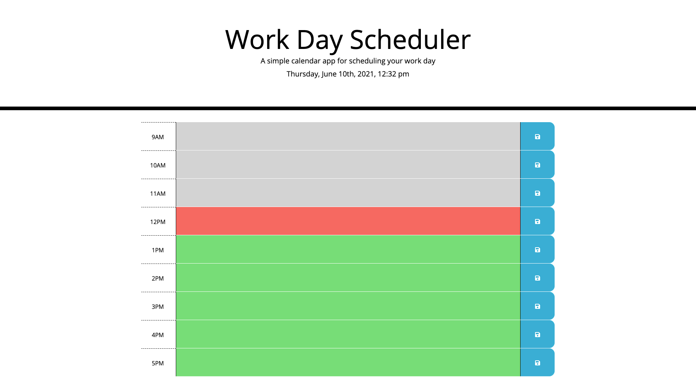

# Work-day-planner

## Description
This planner gives typical 9-5 worker to implement their notes to keep track of what to do for the work hours.

## What was your motivation?
- I really wanted to utilize 3rd party API's.
- After learning about js from scratch, it was surprising to know that their were easier ways to code in js.

## Why did I build this project?
- As someone who likes to stay on schedule, I wanted to create an application where I can track my progress of what to do for the day.
- I built the interface to be as simple as possible and to visually see if the time has passed or not.

## What problem does it solve?
- I ran into using 3 party languages errors.
    - Because I got confortable with vanilla javascript, learning other formats to code was quite difficult to understand and implement.

## What did I learn?
- Overall, building this application was an amazing experience, and continually learning more js is always a good challenge for someone who wants to enter into the tech industry.
    

## Link to URL
https://dn-vanguard.github.io/Work-day-planner/

## Screenshots
This photo was taken on June 10, at 5:14am
(A previous photo was taken, but did not show the color scheme of the times, therefore, retook screenshot and uploaded to readme file)

(**Note: the photo above shows the time at 5AM, and is only intended to show the color scheme of the time the photo was taken.
However the code has been updated to view as a 9-5 schedule starting at 9:00AM as shown in the picture below.)

